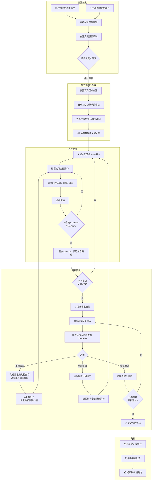
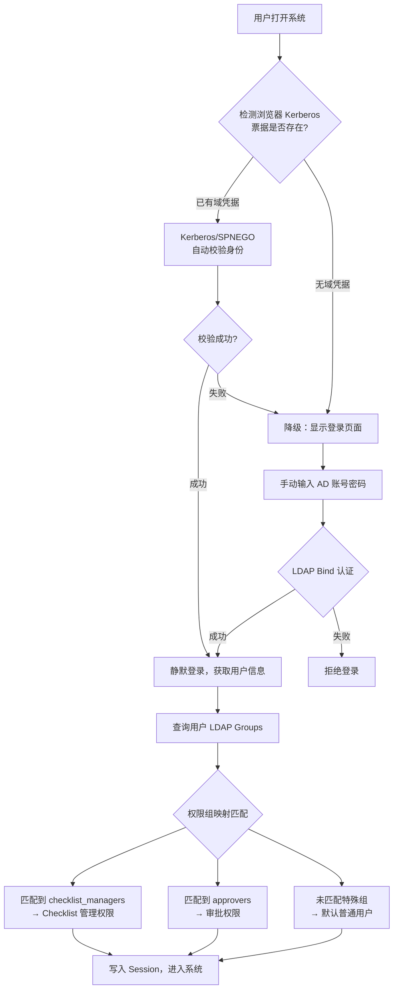

# 变更管理系统 (Change Management System) — 项目计划

> **状态：需求澄清阶段** | 最后更新：2026-06-26

---

## 目录

1. [系统概述](#1-系统概述)
2. [核心流程图](#2-核心流程图)
3. [角色与权限](#3-角色与权限)
4. [功能模块拆解](#4-功能模块拆解)
5. [数据模型草案](#5-数据模型草案)
6. [通知机制](#6-通知机制)
7. [技术栈建议](#7-技术栈建议)
8. [UI 设计规范](#8-ui-设计规范)
9. [Vibecoding 开发说明（分步迭代）](#9-vibecoding-开发说明分步迭代)
10. [待澄清需求（必答）](#10-待澄清需求必答)
11. [开放问题（建议讨论）](#11-开放问题建议讨论)

---

## 1. 系统概述

**目标**：构建一个端到端的变更管理平台，覆盖从变更创建、任务分解、逐项执行、证据留存、模块审批到最终结项的完整生命周期。

**核心价值链**：

```
触发变更  →  分解任务  →  逐项执行+留痕  →  模块审批  →  变更完成
```

---

## 2. 核心流程图



---

## 3. 角色与权限

| 角色 | 职责 | 权限 |
|------|------|------|
| **变更发起人 (Initiator)** | 手动创建变更或确认邮件生成的变更 | 创建变更、编辑草稿、为变更关联模块 |
| **Checklist 负责人 (Checklist Manager)** | 创建和管理模块的 Checklist 模板，定义每一项检查内容 | 创建/编辑/删除 Checklist 模板及条目；属于「Checklist 管理组」的成员拥有此权限 |
| **模块执行人 (Executor)** | 接收通知、逐项完成 Checklist 并上传证据 | 查看/执行/关闭分配的 Checklist 项 |
| **模块审批人 (Approver)** | 审核本模块所有变更内容及证据 | 查看本模块变更详情、通过/驳回 |
| **系统管理员 (Admin)** | 管理用户、权限组、模块定义、全局配置 | 全局配置、分配用户到权限组 |

### 3.1 权限组机制

#### LDAP 登录 + 权限组自动匹配

**双通道登录策略**：优先 Kerberos 无感自动登录，失败降级为手动输入密码。



- **Kerberos 自动登录（主通道）**：域内用户打开浏览器即自动完成身份校验，无需看到登录页
- **手动登录（降级通道）**：非域内环境或 Kerberos 失败时，展示简洁的登录表单
- **Checklist 管理组 (checklist_managers)**：组内成员拥有 Checklist 模板的 **创建、编辑、删除** 权限
- **审批人组 (approvers)**：组内成员可被指定为模块审批人
- **其他用户**：仅可 **查看** Checklist 内容（在执行变更时使用，不可修改模板）
- 权限组由 Admin 维护 LDAP Group 映射规则，支持灵活增减映射

---

## 4. 功能模块拆解

### 4.1 变更创建
- **手动创建**：Web 表单填写变更标题、描述、关联模块、优先级、计划时间窗口
- **优先级**：`紧急 (Critical)` / `高 (High)` / `中 (Medium)` / `低 (Low)`，影响列表排序和邮件通知的紧急标识
- **计划时间窗口**：变更预计执行的起止时间段（如 `2026-06-28 02:00 ~ 04:00`），用于协调变更窗口、避免冲突
- **邮件创建（首期）**：用户手动粘贴邮件原文到备注或描述字段，或直接手动创建变更项目，无需自动解析
- 变更项目状态：`draft → active → executing → reviewing → completed / rejected`

### 4.2 模块与 Checklist 管理

#### 模块管理
- Admin 根据**部门/团队数量**动态创建和管理模块（非固定预设）
- 每个模块对应一个实际的组织部门或业务团队（如：平台部、网络部、安全部、DBA 团队等）
- Admin 可对模块进行：新建 / 编辑 / 停用 / 删除
- 每个模块可指定默认的 Checklist 负责人和执行人

#### Checklist 模板管理（独立功能页面）
- 提供专门的 **Checklist 管理页面**，用于创建和维护各模块的 Checklist 模板
- **Checklist 管理组** 成员可在此页面：
  - 创建新的 Checklist 模板（关联到某个模块）
  - 为模板添加/编辑/删除/排序检查项
  - 每项包含：标题、详细描述、预期结果、执行指导、证据类型要求（截图/日志/配置等）
  - 设置检查项是否为必填
  - 为每项指定**默认执行人**（从对应模块关联的用户中选择）
- **非管理组用户** 在此页面仅可查看（只读），不可修改
- 创建变更时，根据关联模块自动从模板**实例化** Checklist（拷贝一份快照，含默认执行人）

### 4.3 任务执行
- 执行人查看分配给自己的 Checklist 待办
- **执行人可调整**：变更发起人或模块负责人可在变更创建后手动更换某项的执行人（如原执行人请假、调岗等场景）
- 逐项标记状态：`pending → in_progress → done`（审批驳回后 `done → rejected`，需重新执行）
- 每项支持上传附件（截图、日志、配置文件等）
- 填写执行备注/说明后关闭

### 4.4 审批流程
- 全部 Checklist 完成后，变更进入审批阶段
- **仅一级审批**：每个模块只需模块负责人审批，无多级上报流程
- **按模块独立审批**：每个模块负责人独立审批自己模块的变更
- 审批人可查看：变更内容摘要 + Checklist 执行记录 + 上传的证据
- **审批人可灵活选择驳回范围**：
  - **单项驳回**：勾选具体不合规的检查项，逐项填写驳回理由，仅被驳回的项退回执行人重新执行（其他项保留通过状态）
  - **全部驳回**：填写整体驳回理由，该模块全部检查项退回重新执行
- **驳回后重新审批**：执行人重做被驳回项后重新提交，审批人仅需审核重做的项
- **全部模块审批通过才算完成**：所有关联模块都审批通过后，变更项目状态自动流转为「已完成」，任一模块未通过则变更不可关闭

### 4.5 通知系统
- **纯邮件通知**：所有通知通过邮件发送，无需站内通知或其他 IM 集成
- 邮件模板：根据不同事件（创建、审批、驳回等）使用对应的邮件模板
- 邮件内容包含变更项目关键信息和系统链接，方便一键跳转处理

---

## 5. 数据模型草案

```
┌──────────────────┐     ┌─────────────────────┐
│  PermissionGroup │     │  User               │
│                  │     │                     │
│ name             │     │ name                │
│ slug             │     │ email               │
│ description      │     │ permission_groups[]  │
│ members[]        │     │ modules[]           │
└──────────────────┘     └─────────────────────┘

┌──────────────────┐     ┌──────────────────────┐
│  Module          │     │  ChecklistTemplate   │
│                  │     │                      │
│ name             │←────│ module_id            │
│ description      │     │ name                 │
│ default_manager  │     │ description          │
│                  │     │ created_by           │
│                  │     │ updated_by           │
│                  │     │ created_at           │
│                  │     │ updated_at           │
└──────────────────┘     └──────────┬───────────┘
                                    │ 1:N
                          ┌─────────▼───────────┐
                          │  ChecklistItemDef   │  ← 模板定义（管理组维护）
                          │                     │
                          │ title               │
                          │ description         │
                          │ expected_result     │
                          │ evidence_type       │
                          │ is_required         │
                          │ default_executor_id │  ← 默认执行人
                          │ sort_order          │
                          └─────────────────────┘

┌─────────────────┐     ┌─────────────────┐     ┌─────────────────────┐
│  ChangeProject   │────→│  ChangeModule    │────→│  ChecklistItem      │
│                  │     │                  │     │  (实例，执行时使用)   │
│ title            │     │ module_id        │     │                     │
│ description      │     │ status           │     │ title               │
│ priority         │     │ approver_id      │     │ description         │
│ status           │     │ approved_at      │     │ expected_result     │
│ planned_window   │     │ reject_reason    │     │ status              │
│ created_by       │     │                  │     │ executor_id         │
│ created_at       │     │                  │     │ executed_at         │
│ completed_at     │     │                  │     │ evidence_notes      │
│ updated_at       │     │                  │     │ attachments[]       │
│                  │     │                  │     │ reject_reason       │
└─────────────────┘     └─────────────────┘     └─────────────────────┘

┌─────────────────┐
│  Notification   │
│                 │
│ type            │
│ recipient_id    │
│ title           │
│ content         │
│ read            │
│ sent_at         │
└─────────────────┘
```

> **关键设计**：`ChecklistItemDef` 是模板定义（由管理组维护），创建变更时拷贝为 `ChecklistItem` 实例（快照），保证执行记录不受后续模板修改影响。

---

## 6. 通知机制

| 触发事件 | 通知对象 | 通知内容 |
|---------|---------|---------|
| 变更项目创建 | 关联模块的执行人 | "新变更项目「XXX」，请查看 Checklist" |
| Checklist 全部完成 | 变更发起人 | "所有模块 Checklist 已完成，可发起审批" |
| 发起审批 | 各模块审批人 | "模块「XXX」变更待审批，请查看详情" |
| 审批驳回（单项） | 对应执行人 | "检查项「XXX」被驳回，原因：XXX，请重新执行" |
| 审批驳回（全部） | 对应模块执行人 | "模块「XXX」审批被退回，原因：XXX，请重新执行全部检查项" |
| 所有审批通过 | 所有参与人 | "变更项目「XXX」已完成" |

---

## 7. 技术栈建议

| 层次 | 建议方案 | 备注 |
|------|---------|------|
| **前端** | Next.js (App Router) + Tailwind CSS + shadcn/ui | 快速构建 UI，组件丰富 |
| **后端** | Next.js API Routes / tRPC | 单体优先，后续可拆 |
| **数据库** | PostgreSQL (Supabase) | 托管服务，自带 Auth + Realtime |
| **ORM** | Prisma | 类型安全，迁移方便 |
| **邮件服务** | Resend / SendGrid | 邮件通知发送 |
| **邮件接收** | SendGrid Inbound Parse / CloudMailin | 邮件创建变更（待澄清） |
| **文件存储** | Supabase Storage / S3 | 证据附件 |
| **认证** | NextAuth.js (LDAP + Kerberos Provider) | 优先 Kerberos 无感登录，降级 LDAP 手动登录 |
| **权限组同步** | LDAP Groups → 系统权限组映射 | 用户登录时自动匹配权限组 |
| **国际化** | next-intl / react-i18next | 框架支持中英双语切换，首期仅开发中文 |
| **部署** | Vercel / Railway | 一键部署 |

---

## 8. UI 设计规范

### 8.1 设计理念

- **专业稳重**：变更管理面向运维/DevOps 场景，界面传达可靠、严谨的品牌感
- **信息清晰**：状态标签、进度条、时间线等组件清晰传递变更生命周期
- **高效操作**：减少点击层级，关键操作不超过 2 步，批量操作支持
- **现代化**：暗色模式、玻璃态、微交互 —— 2026 年审美标准

### 8.2 色彩系统

| Token | 亮色模式 | 暗色模式 | 用途 |
|-------|---------|---------|------|
| `background` | `#FAFAFA` | `#0A0A0A` | 页面底色 |
| `surface` | `#FFFFFF` | `#171717` | 卡片/面板 |
| `border` | `#E5E5E5` | `#262626` | 分割线/边框 |
| `primary` | `#18181B` | `#FAFAFA` | 主文字/强调按钮 |
| `accent` | `#2563EB` | `#3B82F6` | 链接/交互色 |
| `success` | `#16A34A` | `#22C55E` | 通过/完成 |
| `warning` | `#D97706` | `#F59E0B` | 待处理 |
| `danger` | `#DC2626` | `#EF4444` | 驳回/删除 |
| `muted` | `#737373` | `#A3A3A3` | 次要文字 |

### 8.3 整体布局

```
┌──────────────────────────────────────────────────────┐
│  Sidebar (240px)         │  Top Nav (sticky)         │
│                           │  ─────────────────────── │
│  ┌─────────────────┐     │                           │
│  │  🏠 仪表盘       │     │  ┌─ Page Content ───────┐ │
│  │  📋 变更项目     │     │  │                       │ │
│  │  ✅ Checklists  │     │  │  [Breadcrumb]         │ │
│  │  📝 我的待办     │     │  │                       │ │
│  │  🔔 审批中心     │     │  │  <h1> Page Title      │ │
│  │  📊 变更历史     │     │  │                       │ │
│  │  ⚙️ 系统设置     │     │  │  [Action Bar]         │ │
│  └─────────────────┘     │  │  [Data Table / Cards]  │ │
│                           │  │                       │ │
│  [User Avatar]           │  │  [Pagination]          │ │
│  [Dark Mode Toggle]      │  └───────────────────────┘ │
└──────────────────────────────────────────────────────┘
```

- **Sidebar**：固定 240px 宽，可折叠至 56px（仅图标），响应式下转为抽屉式
- **Top Nav**：面包屑 + 页面标题 + 全局操作（搜索、通知铃铛、用户头像）
- **Content**：最大宽度 1280px，水平居中，padding 24px

### 8.4 关键页面设计

#### 8.4.1 变更项目列表页

```
┌─────────────────────────────────────────────────────────┐
│  变更项目                        [+ 创建变更]  🔍 搜索  │
│  ┌─────────────────────────────────────────────────────┐│
│  │ [全部] [执行中] [审批中] [已完成]  ← Tab 切换        ││
│  ├─────────────────────────────────────────────────────┤│
│  │ ┌─────────────────────────────────────────────────┐ ││
│  │ │ 🔴 SERVER-2024-001  数据库主从切换              │ ││
│  │ │ 模块: 数据库 · 网络  │ 优先级: 紧急             │ ││
│  │ │ 进度 ████████░░ 78%  │ 审批: DB ✅ · NET ⏳     │ ││
│  │ │ 创建人: 张三  ·  2026-06-25 14:30               │ ││
│  │ └─────────────────────────────────────────────────┘ ││
│  │ ┌─────────────────────────────────────────────────┐ ││
│  │ │ 🟡 SERVER-2024-002  CDN 证书更新                │ ││
│  │ │ ...                                              │ ││
│  │ └─────────────────────────────────────────────────┘ ││
│  └─────────────────────────────────────────────────────┘│
└─────────────────────────────────────────────────────────┘
```

#### 8.4.2 Checklist 管理页面（权限组可编辑）

```
┌──────────────────────────────────────────────────────────┐
│  Checklist 管理                                           │
│  ┌─ Module List ─┐  ┌─ Checklist Items ─────────────────┐│
│  │               │  │  数据库变更 Checklist     [编辑]   ││
│  │ 📦 数据库  ◄  │  │  ┌───────────────────────────────┐││
│  │ 🌐 网络       │  │  │ #1 备份当前数据库        [必填]│││
│  │ ⚛️  前端       │  │  │   执行前完整备份，验证可恢复   │││
│  │ 🔒 安全       │  │  │   证据类型: 截图               │││
│  │               │  │  ├───────────────────────────────┤││
│  │ [+ 新建模块]  │  │  │ #2 通知业务方              [选填]│││
│  │               │  │  │   提前2小时通知受影响业务线     │││
│  │               │  │  ├───────────────────────────────┤││
│  │               │  │  │ [+ 添加检查项]  [拖拽排序]     │││
│  │               │  │  └───────────────────────────────┘││
│  └───────────────┘  └────────────────────────────────────┘│
└──────────────────────────────────────────────────────────┘
```

#### 8.4.3 变更详情页（执行视图）

```
┌──────────────────────────────────────────────────────────┐
│  ← 返回    SERVER-2024-001 · 数据库主从切换               │
│  ┌──────────────────────────────────────────────────────┐│
│  │ 状态: 执行中  │  优先级: 🔴 紧急  │  窗口: 06-27 02:00││
│  └──────────────────────────────────────────────────────┘│
│                                                          │
│  模块: 数据库                   总体进度 5/7 · 71%       │
│  ┌──────────────────────────────────────────────────────┐│
│  │  ✅ 备份当前数据库                                    ││
│  │     执行人: 张三  ·  06-26 01:00                      ││
│  │     📎 backup_log.txt  🖼️ screenshot_01.png           ││
│  │     "已通过 mysqldump 完成全量备份，文件大小 2.3G"     ││
│  ├──────────────────────────────────────────────────────┤│
│  │  ✅ 通知业务方                                        ││
│  │     ...                                               ││
│  ├──────────────────────────────────────────────────────┤│
│  │  ⏳ 停止从库同步              ← 当前进行中             ││
│  │     [上传证据] [填写备注]     [标记完成]               ││
│  ├──────────────────────────────────────────────────────┤│
│  │  ⬜ 执行主从切换              ← 待执行                 ││
│  │     ...                                               ││
│  └──────────────────────────────────────────────────────┘│
│                                                          │
│  [← 返回]                              [发起审批 →]     │
└──────────────────────────────────────────────────────────┘
```

#### 8.4.4 审批视图

```
┌──────────────────────────────────────────────────────────┐
│  审批中心 · 模块「数据库」· SERVER-2024-001               │
│  ┌──────────────────────────────────────────────────────┐│
│  │ 变更摘要                                             ││
│  │ 数据库主从切换，计划于 06-27 02:00-04:00 执行         ││
│  └──────────────────────────────────────────────────────┘│
│                                                          │
│  Checklist 执行记录 (5/5 完成)                            │
│  ┌──────────────────────────────────────────────────────┐│
│  │  ✅ 备份当前数据库    附件: 2 files  备注: "..."      ││
│  │  ✅ 通知业务方        附件: 0 files  备注: "..."      ││
│  │  ✅ 停止从库同步      附件: 1 file   备注: "..."      ││
│  │  ✅ 执行主从切换      附件: 3 files  备注: "..."      ││
│  │  ✅ 验证同步状态      附件: 2 files  备注: "..."      ││
│  └──────────────────────────────────────────────────────┘│
│                                                          │
│  审批意见 ┌─────────────────────────────────────────┐    │
│           │                                         │    │
│           └─────────────────────────────────────────┘    │
│                                                          │
│  [❌ 驳回 (需填理由)]              [✅ 审批通过]          │
└──────────────────────────────────────────────────────────┘
```

### 8.5 组件风格

| 组件 | 规范 |
|------|------|
| **按钮** | `rounded-lg`(8px)，高度 40px(h-10)，主按钮 solid 黑底白字，次按钮 outline |
| **卡片** | `rounded-2xl`(16px)，白底 + 1px border + 微弱阴影 `shadow-sm`，hover 时 `shadow-md` |
| **输入框** | `rounded-lg`，边框 `border-input`，focus 时 ring-2 蓝色光圈 |
| **标签/Badge** | 圆角胶囊形 `rounded-full`，小写文字，语义色背景+文字 |
| **表格** | 无外边框，行间分割线，表头 sticky，hover 行变灰 |
| **对话框** | 居中模态，背景半透明遮罩 `bg-black/40`，内容区 `rounded-2xl`，入场缩放动画 |
| **Toast** | 右上角弹出，`rounded-xl` + 阴影，3 秒自动消失，滑入+淡出动画 |
| **空状态** | 居中插画 + 简短文案 + CTA 按钮 |

### 8.6 动效与微交互

- **页面切换**：内容区淡入（`opacity 0→1, 150ms`），无整页跳变
- **列表加载**：骨架屏（skeleton），避免 spinner 闪烁
- **状态变更**：Checklist 标记完成时，所在行绿色闪烁 → 淡出为正常背景
- **审批操作**：通过/驳回按钮点击后 → 按钮 loading → 成功后卡片收起
- **进度条**：百分比数字随进度平滑增长（CSS transition）
- **通知铃铛**：有未读消息时红点脉冲动画

### 8.7 响应式策略

| 断点 | 布局 |
|------|------|
| `≥1280px` | 完整侧边栏 + 内容区，表格多列 |
| `1024-1279px` | 侧边栏折叠为图标模式 |
| `768-1023px` | 侧边栏隐藏，左上角汉堡菜单抽屉 |
| `<768px` | 单列布局，卡片代替表格，操作按钮折叠至底部固定栏 |

---

## 9. Vibecoding 开发说明（分步迭代）

> 以下按迭代顺序排列，每个 Step 是一个可独立交付的里程碑。

### Step 1 — 项目脚手架 + 数据模型
- 初始化 Next.js + Tailwind + shadcn/ui + Prisma
- 集成 next-intl 国际化框架，创建 `zh-CN` / `en` 语言包目录结构
- 首期所有文案使用中文 key，后续可按需补充英文翻译
- 设计并生成 Prisma Schema，跑首次迁移
- 搭建基础布局（侧边栏 + 内容区）

### Step 2 — LDAP/Kerberos 认证与权限组
- **Kerberos/SPNEGO 自动登录（主通道）**：域内用户打开浏览器自动校验，无登录页
- **LDAP 手动登录（降级通道）**：非域环境或自动校验失败时，展示简洁登录表单
- 集成 NextAuth.js，同时配置 Kerberos Provider + LDAP Provider
- 用户首次登录自动创建本地用户记录
- **LDAP Group → 权限组映射**：根据 LDAP 用户所属的组自动匹配系统权限组
  - 例：LDAP `cn=checklist_managers,ou=groups` → 系统 `checklist_managers` 权限组
- Admin 可在系统内手动调整用户权限组
- 用户与模块的关联关系（执行人/审批人归属模块）

### Step 3 — 模块管理（Admin）+ Checklist 模板管理页面
- Admin 根据部门数量动态创建/编辑/停用模块（名称、所属部门、描述、默认负责人）
- 模块列表页，支持搜索和筛选
- **Checklist 管理页面**（核心功能页面）：
  - 左侧模块列表，右侧对应 Checklist 模板
  - **Checklist 管理组**成员可：新建模板、添加/编辑/删除/拖拽排序检查项
  - 每项配置：标题、详细描述、预期结果、证据类型、是否必填、默认执行人
  - **非管理组用户**只能查看（只读模式），按钮置灰
  - 变更历史记录模板的修改人/修改时间

### Step 4 — 变更项目创建
- 手动创建变更项目表单（选择模块、填写标题/描述/优先级/时间窗口）
- 自动从模板生成 Checklist 实例，继承默认执行人
- **支持在创建时手动调整各检查项的执行人**（覆盖模板默认值）
- 变更项目列表页 + 详情页

### Step 5 — 邮件创建变更（首期简化，后续迭代增强）

#### 首期：手动创建 / 手动粘贴
- 用户自主在系统中填写表单创建变更
- 或用户手动粘贴邮件原文到备注/描述字段中
- 无需任何自动解析或邮件基础设施

#### 后续迭代：自动监听（待评估需求后实施）
- 配置邮件接收 Webhook（SendGrid Inbound Parse / CloudMailin）
- 收到邮件 → 自动创建草稿变更 → 通知发起人确认

> **邮件自动解析难度分析**：
>
> | 方案 | 优点 | 难点 |
> |------|------|------|
> | **IMAP 轮询** | 无需改 DNS / MX 记录 | 需邮箱账号密码，存在轮询延迟，需处理邮箱锁定 |
> | **Webhook 接收** | 实时推送，服务商托管 | 需配置 MX 记录指向服务商，依赖第三方 |
> | **SMTP 自建** | 完全自主可控 | 运维成本高，需维护 SMTP 服务 |
>
> 解析难点：邮件正文为自由格式，需统一模板或 LLM 方可可靠提取字段。首期手动创建规避所有复杂度。

### Step 6 — Checklist 执行
- 执行人视图：我的待办 Checklist
- 逐项执行：填写备注 + 上传附件
- **执行人变更**：变更发起人/模块负责人可在执行阶段手动更换某项执行人
- 状态流转动画 + 进度条
- 模块全部完成后的状态联动

### Step 7 — 审批流程
- 发起审批按钮（仅 Checklist 全部完成时可用）
- 审批人视图：模块变更详情 + Checklist 执行记录（每项含证据附件）
- **灵活驳回**：审批人可勾选具体检查项逐条驳回（填写逐项理由），或一键全部驳回
- 驳回后：仅被驳回项退回执行人，状态变为 `rejected`；已通过项保持 `done`
- 执行人重做后重新提交 → 审批人仅复核重做项

### Step 8 — 通知系统
- 集成邮件服务（Resend / SendGrid）：在关键事件节点（变更创建、Checklist 完成、审批发起、驳回）自动触发邮件发送
- 邮件模板包含：变更标题 + 系统链接 + 关键信息摘要，支持一键跳转至系统处理

### Step 9 — 归档与历史
- 变更完成后自动归档
- 变更历史列表 + 全文搜索
- 导出变更报告（PDF）

### Step 10 — 打磨与部署
- 全局 Loading/Empty/Error 状态处理
- 响应式适配
- 部署至 Vercel

---

## 10. 待澄清需求（必答）

> 在开始编码前，请明确以下问题：

1. ~~**邮件创建变更**~~ ✅ 已澄清 → 首期用户手动创建变更或粘贴邮件原文即可，无需自动解析。后续视需求量再评估 Webhook 方案。
2. ~~**模块定义**~~ ✅ 已澄清 → 模块由 Admin 根据部门数量动态创建，每个模块对应一个实际组织部门（非固定预设），支持新建/编辑/停用。
3. ~~**Checklist 模板**~~ ✅ 已澄清 → Checklist 由负责人自行定义，设有专门的 Checklist 管理页面，权限组成员可创建/修改，其他人只读。按变更项目创建时从模板实例化快照。
4. ~~**执行人分配**~~ ✅ 已澄清 → 模板中预设默认执行人，创建变更时自动继承；变更发起人/模块负责人在创建及执行阶段均可手动更换执行人。
5. ~~**审批层级**~~ ✅ 已澄清 → 仅一级审批（模块负责人），无需多级上报。所有模块全部审批通过后变更项目自动完成，任一模块未通过则变更不可关闭。
6. ~~**驳回流程**~~ ✅ 已澄清 → 审批人可灵活选择：勾选具体项逐条驳回（非勾选项保留通过状态），或全部驳回整个模块。驳回后执行人仅重做被驳回项，审批人仅复核重做项。
7. ~~**通知渠道**~~ ✅ 已澄清 → 仅邮件通知，不需要 Teams / 站内通知 / WebSocket / 企业微信等 IM 集成。移除 Supabase Realtime，Step 8 简化为纯邮件。
8. ~~**用户系统**~~ ✅ 已澄清 → 使用 LDAP 登录，根据 LDAP 用户组自动映射系统权限组（如 `checklist_managers`）。
9. ~~**优先级与 SLA**~~ ✅ 已澄清 → 四级优先级（紧急/高/中/低），影响排序和邮件紧急标识；计划时间窗口必填，记录变更执行的起止时间。
10. ~~**多语言**~~ ✅ 已澄清 → 框架集成了 next-intl 支持中英双语切换，首期仅开发中文界面，后续可按需补充英文翻译。

---

## 11. 开放问题（建议讨论）

- 是否需要"变更窗口"概念（只能指定时间段内执行变更）？
- 是否需要变更影响分析（关联系统自动识别）？
- Checklist 执行是否需要"双人复核"（一人执行、另一人确认）？
- 是否需要仪表盘（统计各模块变更数量、平均审批时长等）？
- 是否需要 API 开放给外部系统（如监控系统自动创建变更）？

---

> **下一步**：全部 10 项需求已澄清完毕，可以进入 Step 1 开发。随时告诉我开始。

---

## 变更记录

| 日期 | 变更内容 |
|------|---------|
| 2026-06-26 | 初始版本创建 |
| 2026-06-26 | **需求澄清 #3**：Checklist 由负责人自行定义，新增 Checklist 管理页面 + 权限组机制；更新角色表、数据模型、开发步骤 |
| 2026-06-26 | **需求澄清 #8**：确定使用 LDAP 登录，LDAP Groups 自动映射系统权限组；更新技术栈（NextAuth.js LDAP Provider）、Step 2、新增 LDAP 流程图 |
| 2026-06-27 | **新增 UI 设计规范（第 8 节）**：色彩系统、布局框架、4 个关键页面的 ASCII 线框图、组件风格、动效微交互、响应式策略 |
| 2026-06-27 | **需求澄清 #2**：模块由 Admin 根据部门数量动态创建，每个模块对应实际组织部门，非固定预设；更新 4.2 模块管理、Step 3 |
| 2026-06-27 | **需求澄清 #7**：通知仅邮件，不做 Teams / 站内 / IM 集成；移除 Supabase Realtime、WebSocket，简化 4.5 通知系统、技术栈、Step 8 |
| 2026-06-27 | **需求澄清 #9**：四级优先级 + 计划时间窗口必填；更新 4.1 变更创建细节 |
| 2026-06-27 | **需求澄清 #6**：审批人灵活驳回 — 单项勾选驳回（保留其他项）或全部驳回；更新流程图审批分支、4.4、数据模型（ChecklistItem 新增 `reject_reason`）、通知表、Step 7 |
| 2026-06-27 | **需求澄清 #5**：仅一级审批（模块负责人），所有模块通过后变更自动完成；更新 4.4 明确标注 |
| 2026-06-27 | **需求澄清 #4**：模板预设默认执行人 + 创建/执行阶段可手动更换；更新 4.2、4.3、数据模型（ChecklistItemDef 新增 `default_executor_id`）、Step 4、Step 6 |
| 2026-06-27 | **需求澄清 #10**：集成 next-intl 国际化框架，首期中文界面；更新技术栈、Step 1 |
| 2026-06-27 | **登录流程优化**：LDAP 双通道策略 — 优先 Kerberos/SPNEGO 无感自动登录，失败降级为手动输入密码；更新流程图、技术栈、Step 2 |
| 2026-06-27 | **需求澄清 #1**：邮件创建首期采用手动粘贴模式（规避自动解析的复杂度），Step 5 拆为首期/后续迭代，含 IMAP/Webhook/SMTP 三种方案难度分析 |
